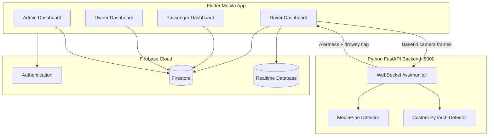

# AlertMate — AI-Based Driver Drowsiness Detection System

[](https://flutter.dev)
[](https://fastapi.tiangolo.com)
[](https://www.python.org)
[](https://pytorch.org)
[](https://firebase.google.com)
[](LICENSE)

> **Final Year Project** — A full-stack intelligent transportation safety platform that detects driver drowsiness in real time using computer vision and deep learning, with role-based mobile dashboards, live GPS tracking, and emergency alerting.

---

## Table of Contents

1. [Project Overview](#project-overview)
2. [Features](#features)
3. [System Architecture](#system-architecture)
4. [Technologies Used](#technologies-used)
5. [Folder Structure](#folder-structure)
6. [Installation Guide](#installation-guide)
7. [Prerequisites](#prerequisites)
8. [Python Dependencies](#python-dependencies)
9. [Environment Configuration](#environment-configuration)
10. [Running the Backend Server](#running-the-backend-server)
11. [Running with Pretrained MediaPipe Model](#running-with-pretrained-mediapipe-model)
12. [Running with Custom Trained Model](#running-with-custom-trained-model)
13. [API Endpoints](#api-endpoints)
14. [Ngrok Setup for Public Access](#ngrok-setup-for-public-access)
15. [Testing Instructions](#testing-instructions)
16. [Troubleshooting](#troubleshooting)
17. [Contributors](#contributors)
18. [License](#license)

---

## Project Overview

**AlertMate** is an AI-powered driver safety system designed to reduce road accidents caused by fatigue and drowsiness. The platform combines:

- A **Flutter mobile application** with role-specific dashboards (Driver, Passenger, Vehicle Owner, Admin)
- A **Python FastAPI backend** that performs real-time facial analysis on camera frames streamed over WebSocket
- **Firebase** (Authentication, Firestore, Realtime Database, Storage) for user management, session tracking, notifications, and live location sharing

The ML backend supports **two detection modes**:

| Mode | Description | Best For |
|------|-------------|----------|
| **MediaPipe** | Google’s pretrained Face Landmarker model with EAR/MAR heuristics | Quick setup, no GPU required, baseline evaluation |
| **Custom PyTorch** | Custom-trained `LandmarkCNN` with adaptive EAR/MAR thresholds | Production accuracy, project-specific training data |

When a driver starts monitoring, the mobile app captures front-camera frames, encodes them as Base64 JSON payloads, and streams them to the backend. The server returns alertness scores, drowsiness flags, and annotated preview frames. Results are persisted to Firebase so passengers, owners, and admins can view live status and location on their dashboards.

---

## Features

### AI & Computer Vision
- Real-time drowsiness detection via **Eye Aspect Ratio (EAR)** and **Mouth Aspect Ratio (MAR)**
- Dual inference pipelines: **MediaPipe Face Landmarker** and **custom PyTorch landmark CNN**
- Adaptive baseline tracking for personalized blink/yawn detection (custom mode)
- Annotated frame feedback streamed back to the mobile client

### Mobile Application (Flutter)
- Multi-role authentication: **Driver**, **Passenger**, **Owner**, **Admin**
- Driver live monitoring with camera preview, alertness meter, and audio alerts
- Passenger vehicle lookup by registration number and live trip status
- Emergency contact management and one-tap calling
- In-app notifications inbox with role-aware filtering
- Admin registry search, analytics charts, and fleet oversight

### Backend & Infrastructure
- FastAPI REST + WebSocket server with CORS enabled
- Configurable detection mode via environment variables
- Automatic MediaPipe model download on first run
- ngrok tunnel support for cross-network mobile testing

---

## System Architecture



### Data Flow — Live Monitoring

1. Driver taps **Start Monitoring** → Firebase monitoring session is created (`status: on_trip`).
2. Flutter opens a WebSocket to `wss://<backend>/ws/monitor`.
3. Camera frames are sent as JSON: `{ "frame": "<base64 JPEG>" }`.
4. Backend runs inference (MediaPipe or custom model) and responds with metrics.
5. Driver dashboard updates UI and writes stats to Firestore / Realtime Database.
6. Passenger, Owner, and Admin dashboards subscribe to live updates.

> **Note:** For physical devices, the backend must be reachable over the public internet. Use [ngrok](#ngrok-setup-for-public-access) or deploy to a cloud VM.

---

## Technologies Used

| Layer | Technology | Purpose |
|-------|------------|---------|
| **Frontend** | Flutter 3.x (Dart) | Cross-platform mobile & web UI |
| **Backend API** | FastAPI + Uvicorn | REST health check + WebSocket inference |
| **ML — Mode 1** | MediaPipe Face Landmarker | Pretrained 478-point facial landmarks |
| **ML — Mode 2** | PyTorch + OpenCV | Custom `LandmarkCNN` + Haar face detection |
| **Cloud** | Firebase Auth, Firestore, RTDB, Storage | Users, sessions, tracking, documents |
| **Maps** | flutter_map + OpenStreetMap | Live driver location visualization |
| **Media** | Cloudinary | Document/image uploads |
| **Tunneling** | ngrok | Public HTTPS/WSS access during development |

---

## Folder Structure

```
Alert-Mate-master/
├── lib/                              # Flutter application source
│   ├── main.dart                     # App entry + public tracking routes
│   ├── main_admin.dart               # Admin entry point
│   ├── auth_screen.dart              # Authentication UI
│   ├── constants/
│   │   ├── app_config.dart           # ngrok / WebSocket URL configuration
│   │   ├── app_theme.dart
│   │   └── app_colors.dart
│   ├── dashboards/
│   │   ├── driver_dashboard.dart     # Live monitoring + ML WebSocket client
│   │   ├── passenger_dashboard.dart
│   │   ├── owner_dashboard.dart
│   │   └── admin_dashboard.dart
│   ├── services/
│   │   ├── monitoring_service.dart   # Drowsiness session lifecycle
│   │   ├── tracking_service.dart     # Live location token generation
│   │   ├── driver_location_service.dart
│   │   └── firebase_auth_service.dart
│   ├── screens/
│   │   ├── public_live_tracking_screen.dart
│   │   └── notifications_inbox_screen.dart
│   ├── models/                       # Data models (User, Vehicle, etc.)
│   └── widgets/                      # Reusable UI components
│
├── python/                           # ML inference backend
│   ├── backend.py                    # FastAPI server (main entry point)
│   ├── Testing.py                    # Custom PyTorch model + landmark utilities
│   ├── detector.py                   # Standalone detector utilities
│   ├── face_landmarker.task          # MediaPipe model (auto-downloaded if missing)
│   └── drowsiness_model.pth.zip      # Custom trained weights (provide your own)
│
├── assets/images/                    # App branding assets
├── android/                          # Android platform project
├── ios/                              # iOS platform project
├── web/                              # Flutter web build
├── pubspec.yaml                      # Flutter dependencies
├── firebase_options.dart             # Generated Firebase config (lib/)
└── README.md                         # This file
```

---

## Installation Guide

### 1. Clone the Repository

```bash
git clone https://github.com/<your-org>/AlertMate.git
cd AlertMate
```

### 2. Set Up Firebase

1. Create a Firebase project at [Firebase Console](https://console.firebase.google.com).
2. Enable **Authentication**, **Firestore**, **Realtime Database**, and **Storage**.
3. Register Android/iOS/Web apps and download config files.
4. Run FlutterFire CLI to generate `lib/firebase_options.dart`:

```bash
dart pub global activate flutterfire_cli
flutterfire configure
```

5. Apply Firestore security rules from `firestore_security_rules.txt` (if present in the repo).

### 3. Install Flutter Dependencies

```bash
flutter pub get
```

### 4. Set Up the Python Backend

```bash
cd python
python -m venv venv

# Windows
venv\Scripts\activate

# macOS / Linux
source venv/bin/activate

pip install --upgrade pip
```

Install dependencies for your chosen mode — see [Python Dependencies](#python-dependencies).

### 5. Configure Backend URL in the Mobile App

Edit `lib/constants/app_config.dart` and set `ngrokBaseUrl` to your public backend URL (see [Ngrok Setup](#ngrok-setup-for-public-access)).

### 6. Run the Application

```bash
# Terminal 1 — Backend
cd python
py backend.py

# Terminal 2 — Flutter
flutter run # for Driver, Passenger and Vehicle Owner Dashboards as Mobile Application
flutter run -d chrome -t lib/main_admin.dart # for Admin Dashboard as Web Application
```

---

## Prerequisites

| Requirement | Minimum Version | Notes |
|-------------|-----------------|-------|
| **Flutter SDK** | 3.9+ | `flutter doctor` must pass |
| **Dart SDK** | 3.9+ | Bundled with Flutter |
| **Python** | 3.10+ | 3.11 recommended |
| **pip** | Latest | For Python packages |
| **Git** | Any recent | Clone & version control |
| **Firebase Account** | — | Free tier sufficient for development |
| **ngrok Account** | — | Required for physical device testing |
| **CUDA GPU** | Optional | Speeds up custom PyTorch inference |

### Platform-Specific

- **Android:** Android Studio, SDK 21+, USB debugging or emulator with camera
- **iOS:** Xcode 14+, macOS, Apple Developer account for device deployment
- **Windows:** Visual Studio Build Tools (for Flutter Windows desktop, optional)

---

## Python Dependencies

### MediaPipe Mode (Lightweight)

```bash
pip install fastapi uvicorn opencv-python mediapipe numpy
```

### Custom PyTorch Mode (Full Accuracy)

```bash
pip install fastapi uvicorn opencv-python numpy torch torchvision pillow scipy
```

### Combined (All Modes)

```bash
pip install fastapi uvicorn opencv-python mediapipe numpy torch torchvision pillow scipy
```

| Package | Purpose |
|---------|---------|
| `fastapi` | HTTP/WebSocket API framework |
| `uvicorn` | ASGI server |
| `opencv-python` | Image decode, face detection, frame encoding |
| `mediapipe` | Pretrained Face Landmarker inference |
| `numpy` | Numerical operations on landmarks |
| `torch` / `torchvision` | Custom CNN landmark model |
| `pillow` | Image preprocessing (legacy mode) |
| `scipy` | Delaunay mesh rendering in custom mode |

> **Recommended:** Create a virtual environment before installing to avoid dependency conflicts with system Python.

---

## Environment Configuration

The backend reads configuration from **environment variables**. Set these in your terminal before starting the server.

| Variable | Default | Description |
|----------|---------|-------------|
| `DROWSINESS_MODE` | `custom` | Detection pipeline: `mediapipe` or `custom` |
| `MEDIAPIPE_MODEL_PATH` | `face_landmarker.task` | Path to MediaPipe `.task` model file |
| `CUSTOM_MODEL_PATH` | `drowsiness_model.pth.zip` | Path to custom PyTorch weights (`.pth` or `.zip`) |

### Windows (Command Prompt)

```cmd
set DROWSINESS_MODE=mediapipe
set MEDIAPIPE_MODEL_PATH=face_landmarker.task
```

### Windows (PowerShell)

```powershell
$env:DROWSINESS_MODE = "mediapipe"
$env:MEDIAPIPE_MODEL_PATH = "face_landmarker.task"
```

### macOS / Linux

```bash
export DROWSINESS_MODE=mediapipe
export MEDIAPIPE_MODEL_PATH=face_landmarker.task
```

### Flutter Backend URL

Update the ngrok base URL in `lib/constants/app_config.dart`:

```dart
static const String ngrokBaseUrl =
    'https://your-subdomain.ngrok-free.app';  // No trailing slash
```

The WebSocket URL is derived automatically:

```
https://example.ngrok-free.app  →  wss://example.ngrok-free.app/ws/monitor
```

---

## Running the Backend Server

1. Navigate to the Python directory and activate your virtual environment:

```bash
cd python
venv\Scripts\activate        # Windows
# source venv/bin/activate   # macOS / Linux
```

2. Set your desired `DROWSINESS_MODE` (see sections below).

3. Start the server:

```bash
py backend.py
```

Expected output:

```
INFO:     Started server process
INFO:     Uvicorn running on http://0.0.0.0:8000
Custom model loaded from: ...   # or MediaPipe detector loaded from: ...
```

4. Verify the health endpoint:

```bash
curl http://localhost:8000/
```

Expected response:

```json
{
  "status": "FastAPI Drowsiness Detection Server Running",
  "mode": "custom"
}
```

> **Warning:** The server binds to `0.0.0.0:8000`. Ensure port 8000 is not blocked by your firewall when testing on a local network.

---

## Running with Pretrained MediaPipe Model

MediaPipe mode uses Google’s pretrained Face Landmarker. The model file is **auto-downloaded** on first run if `face_landmarker.task` is not present.

```bash
pip install fastapi uvicorn opencv-python mediapipe numpy

set DROWSINESS_MODE=mediapipe
set MEDIAPIPE_MODEL_PATH=face_landmarker.task

py backend.py
```

> **Note:** On macOS/Linux, replace `set VAR=value` with `export VAR=value`. On PowerShell, use `$env:VAR = "value"`.

**When to use MediaPipe mode:**
- Rapid prototyping without trained weights
- CPU-only machines
- Baseline comparison against your custom model

---

## Running with Custom Trained Model

Custom mode loads a PyTorch `LandmarkCNN` trained on facial landmark data (478 landmarks). Place your weights at `python/drowsiness_model.pth.zip` or set `CUSTOM_MODEL_PATH` accordingly.

```bash
set DROWSINESS_MODE=custom
set CUSTOM_MODEL_PATH=drowsiness_model.pth.zip

py backend.py
```

> **Note:** If `CUSTOM_MODEL_PATH` points to a `.zip` archive, the backend automatically extracts the embedded `.pth` file on first load.

**When to use custom mode:**
- Best detection accuracy for your dataset
- Adaptive EAR/MAR baselines per driver
- Final Year Project demonstration with your own trained model

> **Warning:** Custom mode requires `torch` and sufficient RAM. First inference may take several seconds while the model loads.

---

## API Endpoints

### REST

| Method | Endpoint | Description | Response |
|--------|----------|-------------|----------|
| `GET` | `/` | Server health check | `{ "status": "...", "mode": "mediapipe\|custom" }` |

### WebSocket

| Endpoint | Protocol | Description |
|----------|----------|-------------|
| `/ws/monitor` | WebSocket (JSON) | Real-time frame streaming & drowsiness inference |

#### Connection Handshake

Upon connect, the server sends:

```json
{
  "status": "connected",
  "mode": "custom",
  "message": "Server ready to receive frames"
}
```

#### Client → Server Message

```json
{
  "frame": "<base64-encoded JPEG image>"
}
```

#### Server → Client Response

Sent at most once per second (or immediately when drowsiness is detected):

```json
{
  "alertness": 87.5,
  "ear": 0.284,
  "mar": 0.312,
  "eyeClosure": 12.0,
  "isDrowsy": false,
  "reason": "alert",
  "drowsyCounter": 0,
  "frame": "<base64-encoded annotated JPEG>"
}
```

| Field | Type | Description |
|-------|------|-------------|
| `alertness` | `float` | 0–100 alertness score (higher = more alert) |
| `ear` | `float` | Eye Aspect Ratio |
| `mar` | `float` | Mouth Aspect Ratio |
| `eyeClosure` | `float` | Estimated eye closure percentage |
| `isDrowsy` | `bool` | `true` if drowsiness event detected |
| `reason` | `string` | `alert`, `eyes_closed`, `yawning`, or `no_face` |
| `drowsyCounter` | `int` | Cumulative drowsiness events in session |
| `frame` | `string` | Annotated preview frame (Base64 JPEG) |

#### Error Response

```json
{
  "error": "Error message description"
}
```

---

## Ngrok Setup for Public Access

Physical mobile devices cannot reach `localhost:8000` on your development machine. **ngrok** creates a secure public tunnel so the Flutter app can connect over HTTPS/WSS from any network.

### Step 1 — Install ngrok

**Windows (winget):**

```powershell
winget install ngrok.ngrok
```

**Windows (Chocolatey):**

```powershell
choco install ngrok
```

**macOS (Homebrew):**

```bash
brew install ngrok
```

**Manual:** Download from [https://ngrok.com/download](https://ngrok.com/download) and add to your `PATH`.

Verify installation:

```bash
ngrok version
```

### Step 2 — Authenticate ngrok

1. Sign up at [https://dashboard.ngrok.com/signup](https://dashboard.ngrok.com/signup).
2. Copy your authtoken from [https://dashboard.ngrok.com/get-started/your-authtoken](https://dashboard.ngrok.com/get-started/your-authtoken).
3. Run:

```bash
ngrok config add-authtoken YOUR_AUTHTOKEN_HERE
```

> **Note:** Authentication is required for stable tunnels and removes session time limits on free accounts.

### Step 3 — Start the FastAPI Backend

```bash
cd python
set DROWSINESS_MODE=custom
py backend.py
```

Confirm the server is listening on port **8000**.

### Step 4 — Expose the Server with ngrok

Open a **second terminal**:

```bash
ngrok http 8000
```

Example output:

```
Session Status                online
Forwarding                    https://abc123.ngrok-free.app -> http://localhost:8000
```

### Step 5 — Obtain the Public URL

Copy the **HTTPS Forwarding URL** from the ngrok terminal, e.g.:

```
https://abc123.ngrok-free.app
```

Test it in a browser:

```
https://abc123.ngrok-free.app/
```

You should see the JSON health response from FastAPI.

### Step 6 — Configure the Flutter App

Edit `lib/constants/app_config.dart`:

```dart
class AppConfig {
  static const String ngrokBaseUrl =
      'https://abc123.ngrok-free.app';  // ← paste your ngrok URL (no trailing slash)

  static String get wsMonitorUrl {
    final base = ngrokBaseUrl
        .replaceFirst('https://', 'wss://')
        .replaceFirst('http://', 'ws://');
    return '$base/ws/monitor';
  }
}
```

Rebuild and run the Flutter app:

```bash
flutter run
```

### Step 7 — Use in Frontend / Mobile Applications

| Client | URL to Use |
|--------|------------|
| REST health check | `https://abc123.ngrok-free.app/` |
| WebSocket monitoring | `wss://abc123.ngrok-free.app/ws/monitor` |
| Flutter (automatic) | `AppConfig.wsMonitorUrl` |

> **Important:**
> - ngrok free URLs **change every restart**. Update `app_config.dart` each time you restart ngrok.
> - ngrok provides **HTTPS** → WebSocket connections **must use `wss://`**, not `ws://`.
> - Keep both terminals running: one for `py backend.py`, one for `ngrok http 8000`.

> **Warning:** Do not commit ngrok authtokens or production URLs to public repositories.

---

## Testing Instructions

### Backend Smoke Test

```bash
# 1. Start server
cd python && py backend.py

# 2. Health check
curl http://localhost:8000/

# 3. WebSocket test (optional — use wscat or a WebSocket client)
npm install -g wscat
wscat -c ws://localhost:8000/ws/monitor
```

### Flutter Application Tests

```bash
flutter analyze
flutter test
flutter run -d chrome    # Web
flutter run -d android    # Android device/emulator
```

### End-to-End Monitoring Flow

1. Start Python backend (custom or MediaPipe mode).
2. Start ngrok and update `app_config.dart`.
3. Log in as **Driver** → grant camera permission.
4. Tap **Start Monitoring** → verify WebSocket connects (check debug console).
5. Simulate drowsiness (close eyes / yawn) → confirm alert triggers.
6. Log in as **Passenger** → search vehicle → verify live status updates.
7. Tap **Share Live Location** → open tracking link in browser.

### Role-Based Test Matrix

| Scenario | Role | Expected Result |
|----------|------|-----------------|
| Start monitoring | Driver | WebSocket connected, alertness bar updates |
| View live status | Passenger | Shows Normal/Drowsy when driver is monitoring |
| Fleet map | Admin/Owner | Driver marker visible only during active session |
| Share tracking link | Passenger | Public map loads with valid token |
| Stop monitoring | Driver | Status resets to idle, stats cleared |

---

## Troubleshooting

### WebSocket Connection Failed

| Symptom | Cause | Fix |
|---------|-------|-----|
| Connection refused | Backend not running | Start `py backend.py` |
| Timeout on mobile | Using `localhost` on device | Use ngrok public URL |
| SSL/TLS error | Using `ws://` with ngrok | Use `wss://` (handled by `AppConfig.wsMonitorUrl`) |
| 404 on WebSocket | Wrong path | Ensure URL ends with `/ws/monitor` |

### MediaPipe Mode Errors

```text
Failed to initialize MediaPipe mode
```

**Fix:** Install MediaPipe and use Python 3.10–3.11:

```bash
pip install mediapipe opencv-python numpy
set DROWSINESS_MODE=mediapipe
```

### Custom Model Not Found

```text
FileNotFoundError: drowsiness_model.pth.zip
```

**Fix:** Place your trained weights in `python/` or set `CUSTOM_MODEL_PATH` to the absolute path.

### Camera Not Available (Flutter)

- Grant camera permission in device settings.
- Use a physical device or an emulator with camera passthrough.
- Restart the app after granting permissions.

### ngrok URL Changed

After restarting ngrok, update `lib/constants/app_config.dart` and hot-restart the Flutter app.

### High Latency / Low FPS

- Use a machine with GPU for custom PyTorch mode.
- Reduce camera resolution in `driver_dashboard.dart`.
- Ensure stable network when using ngrok.

### Firebase Permission Denied

- Verify Firestore security rules are published.
- Confirm the user is authenticated and has the correct role document in Firestore.

---

## Contributors

| Name | Registration Number | Role |
|------|------|------|
| **Abdul Muqeet** | FA22-BCS-168 | Developer |
| **Muhammad Wahb** | FA22-BCS-072 | Developer |

---

## License

This project was developed as a **Final Year Project** for academic purposes.

Unless otherwise specified, all rights are reserved by the project authors. For academic evaluation, citation, or collaboration inquiries, please contact the contributors directly.

---

<p align="center">
  <strong>AlertMate</strong> — Drowsiness Detection System with AI<br/>
  <sub>Built with Flutter · Python · FastAPI · OpenCV · PyTorch · Firebase </sub>
</p>
